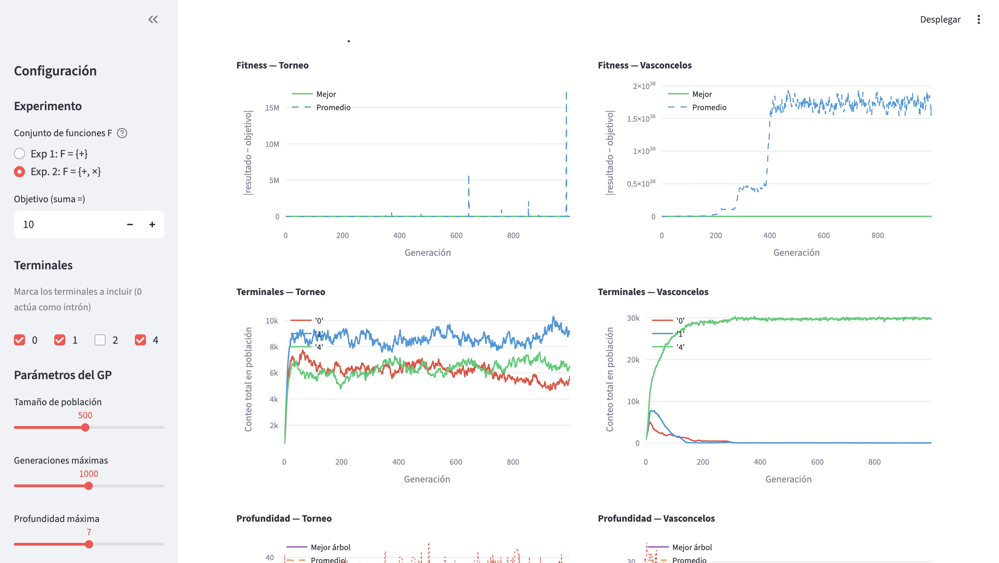
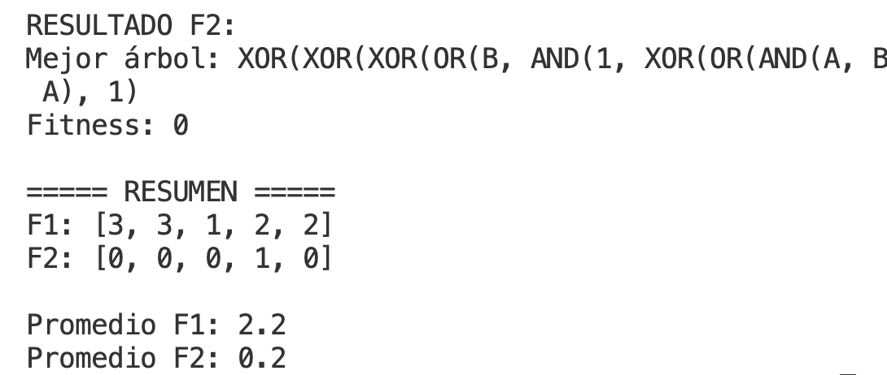

# Programación Genética - Proyecto

Evolutivo de tarea,
Conteo de intrones, 
ejecución:
colocarse en carpeta src y ejecutar:
streamlit run app.py


TAREA PASADA



## Descripción


Este proyecto implementa un sistema de Programación Genética utilizando
el paradigma de Programación Orientada a Objetos (POO). El objetivo es
evolucionar soluciones representadas como árboles, donde cada individuo
es una combinación de funciones y terminales evaluadas sobre un conjunto
de datos.


El diseño permite extender fácilmente el sistema, modificar
operadores genéticos y adaptar el comportamiento a distintos problemas.


------------------------------------------------------------------------


## Arquitectura del Proyecto


El sistema está dividido en varios componentes principales:


### 1. `functions.py`


Contiene un diccionario de funciones disponibles para la construcción de
los árboles.


Cada función incluye: - Aridad (número de argumentos) - Implementación
(lambda o función)


``` python
FUNCTIONS = {
   "AND": {"arity": 2, "function": lambda a, b: int(a and b)},
   "NOT": {"arity": 1, "function": lambda a: int(not a)}
}
```


**Ventajas:** - Permite cambiar funciones fácilmente - Se pueden agregar
nuevas operaciones sin modificar el núcleo - Facilita experimentar con
diferentes operadores según su desempeño


------------------------------------------------------------------------


### 2. `node.py`


Define la estructura del nodo que compone los árboles.


Un nodo puede ser: - Función (con hijos) - Terminal (variable o
constante)


**Responsabilidades:** - Evaluar su valor - Representar subárboles -
Servir como base para la construcción de individuos


------------------------------------------------------------------------


### 3. `tree.py`


Encargado de la generación y manejo de árboles.


**Funciones principales:** - Generación aleatoria de árboles -
Evaluación del árbol completo - Representación del individuo


------------------------------------------------------------------------


### 4. `fitness.py`


Calcula qué tan buena es una solución.


Para problemas booleanos: - Compara la salida del árbol contra datos
esperados - Cuenta errores o calcula precisión


``` python
fitness = errores
```


o


``` python
fitness = 1 - (errores / total)
```


------------------------------------------------------------------------


### 5. `population.py`


Maneja el conjunto de individuos.


**Responsabilidades:** - Crear población inicial - Evaluar individuos -
Gestionar generaciones


------------------------------------------------------------------------


### 6. `selection.py`


Implementa el proceso de selección.


Ejemplo: - Selección por torneo


Permite elegir los mejores individuos para reproducirse.


------------------------------------------------------------------------


### 7. `crossover.py`


Combina dos individuos (árboles) para generar descendencia.


**Características:** - Intercambio de subárboles - Generación de nuevas
soluciones


------------------------------------------------------------------------


### 8. `mutation.py` (extensible)


Introduce variación aleatoria en los individuos:


-   Reemplazo de nodos
-   Alteración de subárboles


------------------------------------------------------------------------


## Flujo del Sistema


El algoritmo sigue el siguiente proceso:


1.  Inicialización\
2.  Evaluación\
3.  Selección\
4.  Crossover\
5.  Mutación\
6.  Reemplazo\
7.  Iteración


------------------------------------------------------------------------


## Uso


1.  Definir funciones en `functions.py`
2.  Configurar datos de entrada
3.  Ejecutar el algoritmo principal
4.  Observar la evolución del fitness


